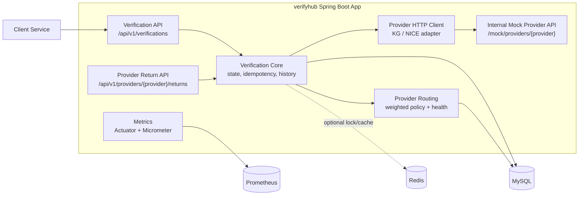
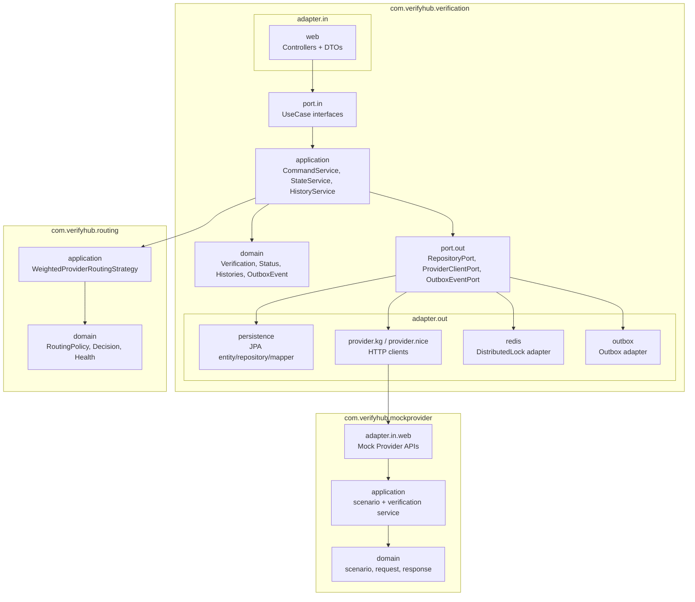
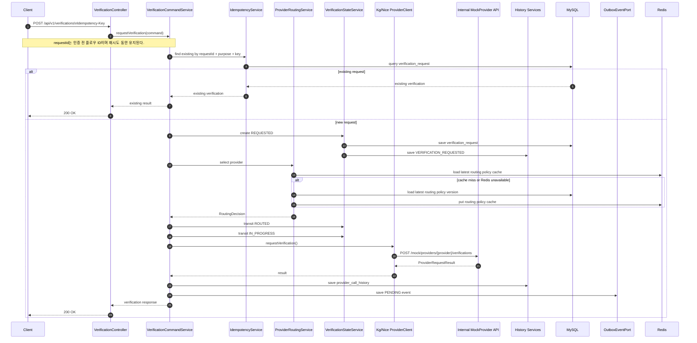
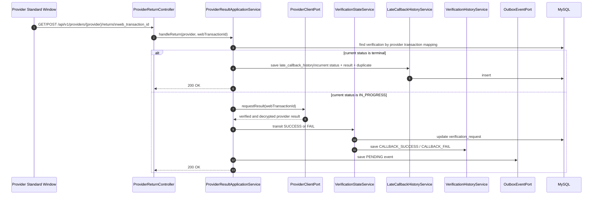
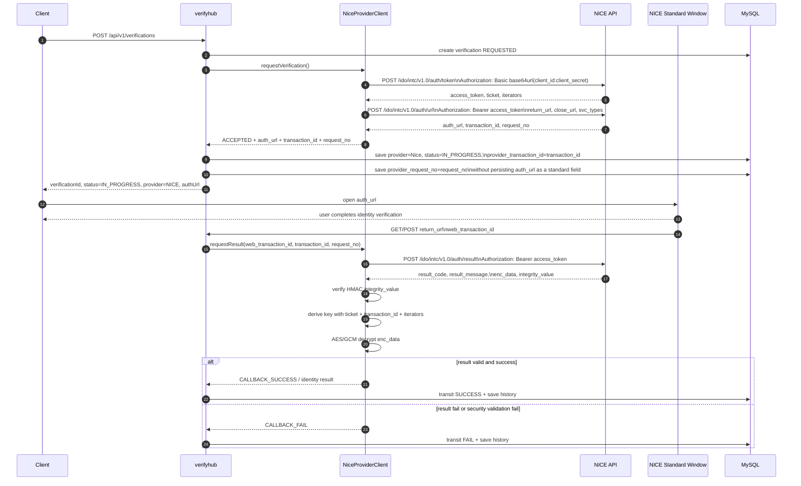
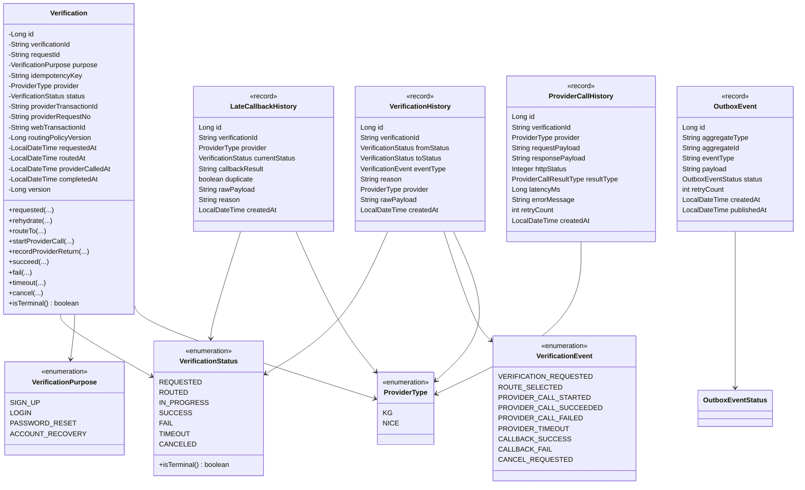
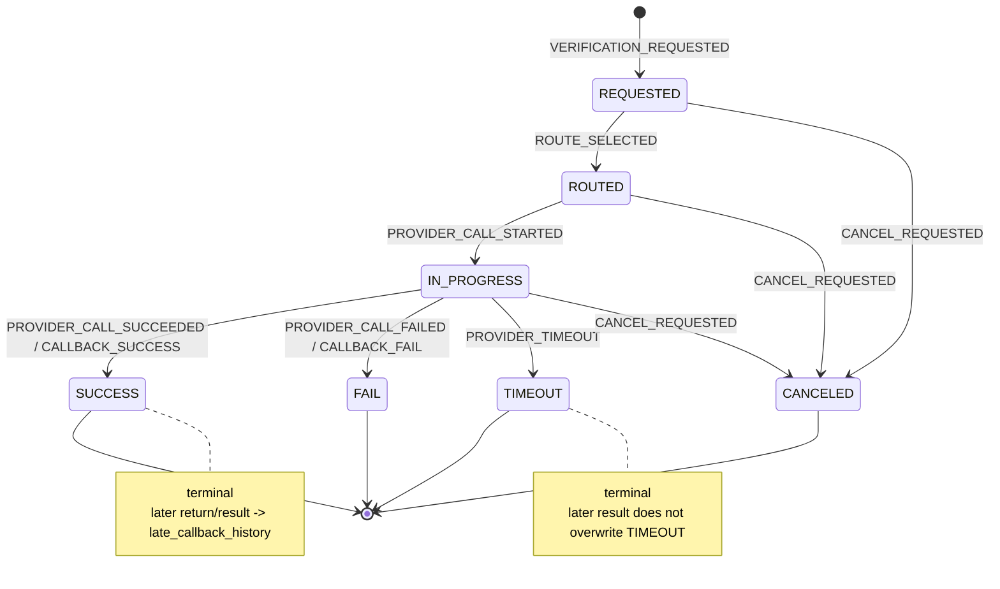
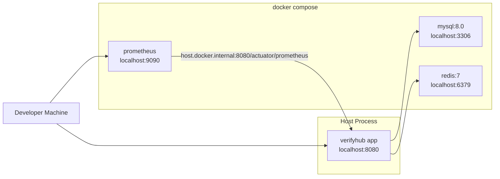

# Verifyhub Architecture Diagrams

이 문서는 `verifyhub`의 전체 구조와 현재 도메인 모델을 Mermaid로 표현한다. 기준은 `ARCHITECTURE.md`와 현재 구현된 `VH-004` 도메인 모델이다.

## 1. System Context

`verifyhub`는 Client와 외부 본인인증 Provider 사이에서 요청 생성, Provider 선택, 상태 전이, return_url 수신, 결과 조회, 이력 저장, 운영 지표 수집을 담당한다. MVP에서는 실제 KG/NICE 서버를 호출하지 않고 같은 Spring Boot 애플리케이션 내부의 `mockprovider` HTTP API를 호출한다.

## 2. Hexagonal Package Structure

핵심 원칙은 `domain`과 `application`이 Spring MVC, JPA, Redis, HTTP client 같은 외부 기술을 직접 알지 않게 하는 것이다. 외부 세계와의 접점은 `port`와 `adapter`로 분리한다.

## 3. Verification Request Flow

인증 요청은 idempotency 확인 후 `REQUESTED -> ROUTED -> IN_PROGRESS` 순서로 진행된다. Mock Provider가 즉시 성공/실패를 반환하는 시나리오에서는 최종 상태까지 반영하고, NICE 표준창 기반 시나리오에서는 `authUrl`을 반환한 뒤 `IN_PROGRESS`를 유지한다.

## 4. Provider Return and Late Result Flow

NICE 표준창 방식에서는 Provider가 결과를 webhook으로 밀어주는 대신, 표준창이 `return_url`로 `web_transaction_id`를 전달한다. verifyhub는 이 값을 받아 Provider 결과 조회 API를 호출하고, `IN_PROGRESS`이면 `SUCCESS` 또는 `FAIL`로 전이한다. 이미 terminal 상태면 최종 상태를 변경하지 않고 `late_callback_history`에 기록한다.

## 5. NICE S2S Guide Fit

`docs/guide/OpenAPI Specification.json` 기준 NICE 통합인증은 단순한 server-to-server 단일 호출이 아니라 표준창을 포함한 하이브리드 플로우다. 이용기관 서버는 NICE API로 접근 토큰을 발급받고, 인증 URL을 발급받은 뒤, Client가 표준창을 열어 인증을 수행한다. 인증이 끝나면 NICE 표준창이 이용기관의 `return_url`로 `web_transaction_id`를 전달하고, 이용기관 서버는 이 값을 이용해 인증 결과 API를 다시 호출한다.

현재 verifyhub 설계는 Provider adapter, 상태 머신, 이력, 멱등성, timeout/retry/circuit breaker를 중심으로 되어 있어 큰 방향은 적절하다. 다만 NICE 연동을 실제화하려면 provider inbound API는 일반적인 provider webhook이 아니라 `return_url` 수신 endpoint 역할로 설계해야 한다. 또한 NICE 결과 응답은 `enc_data`와 `integrity_value`를 포함하므로 Provider adapter 안에 무결성 검증, KDF 키 유도, AES/GCM 복호화 책임을 추가해야 한다.

설계 반영 포인트:

- `ProviderClientPort.requestVerification()`은 NICE의 `/auth/token`과 `/auth/url` 호출을 감싸고, 응답으로 Provider별 인증 진입 URL, `transaction_id`, `request_no`를 표현할 수 있어야 한다.
- `provider_transaction_id`는 NICE 기준 `transaction_id`와 매핑하고, `provider_request_no`는 NICE `request_no`와 매핑한다.
- Provider별 인증 진입 URL은 표준 영속 컬럼으로 저장하지 않는다. 요청 멱등성은 idempotency key와 verification 상태를 기준으로 관리한다.
- `ProviderReturnController`는 NICE 표준창의 `return_url` 수신 endpoint로 사용한다.
- return payload에는 `web_transaction_id`가 포함되고, 이 값으로 `/auth/result`를 호출한다.
- 인증 결과 응답의 `integrity_value` 검증 실패는 retry 대상이 아니라 business/security fail로 처리한다.
- 복호화된 개인정보는 DB에 저장하지 않고 필요한 판정 후 masking된 raw payload 또는 최소 결과만 이력에 남긴다.

## 6. Verification Domain Model

현재 `VH-004` 기준 도메인 모델이다. `Verification`은 앞으로 상태 전이 메서드가 붙을 aggregate라 class로 유지한다. 이력과 이벤트 성격의 객체는 생성 후 변경하지 않으므로 Java 17 `record`를 사용한다.

## 7. Verification State Model

상태 변경은 `VerificationStateMachine` 또는 `VerificationStateService`를 통해서만 수행한다. terminal 상태 이후 도착하는 return/result는 상태를 바꾸지 않고 late callback history로 기록한다.

## 8. Local Runtime Topology

로컬 개발에서는 애플리케이션은 호스트에서 실행하고, MySQL/Redis/Prometheus만 Docker Compose로 실행한다. Prometheus는 Docker 컨테이너에서 호스트 앱의 actuator endpoint를 scrape한다.

